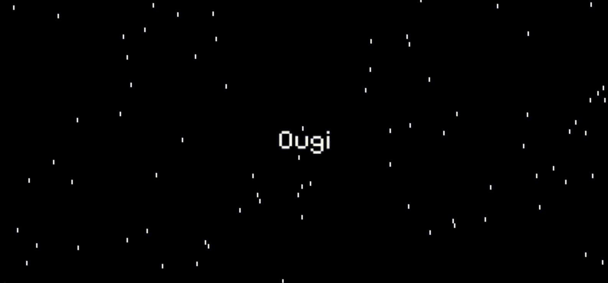

## Hi!

I am Uroš Ognjenović, a **Solidity** developer and **Web3** researcher.

I hold a masters degree in Electrical Engineering.

I use tools such as:
- **Remix**,
- **Foundry** (**Anvil**, **Ganache**, **Cast**),
- **Alchemy**,
- **Etherscan**,
- and more.

## Let's connect

